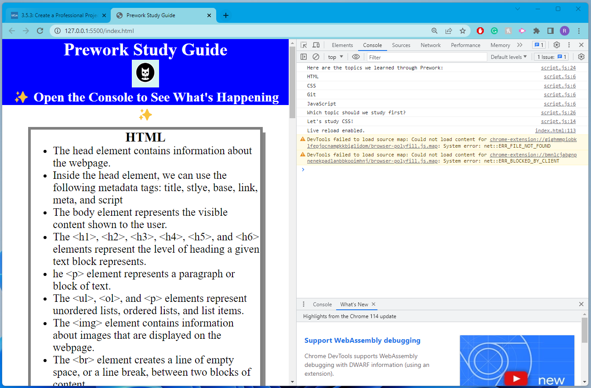

# UCLA Bootcamp Prework Study Guide Webpage

## Description

This Prework Study Guide was created to help students in the bootcamp to get ready for the first day of class. 
My motivation for this project was learning about HTML, CSS, Git, and JS.
I built this project to practice my skills after learning about HTML, CSS, Git, and JS.
Although this does not solve any problems, I can refer to this Study Guide in the future as a reference. 

## Table of Contents (Optional)

If your README is long, add a table of contents to make it easy for users to find what they need.

- [UCLA Bootcamp Prework Study Guide Webpage](#ucla-bootcamp-prework-study-guide-webpage)
  - [Description](#description)
  - [Table of Contents (Optional)](#table-of-contents-optional)
  - [Installation](#installation)
  - [Usage](#usage)
  - [Credits](#credits)
  - [License](#license)

## Installation

N/A

## Usage

To successfully use this Prework Study Guide, the users can review the notes in the section.
The users can check the Console Panel in  Chrome DevTools to check which topics are covered and the recommended order of the topics to study. 

## Credits

N/A

## License

Please refer to the LICENSE in the repository. 

